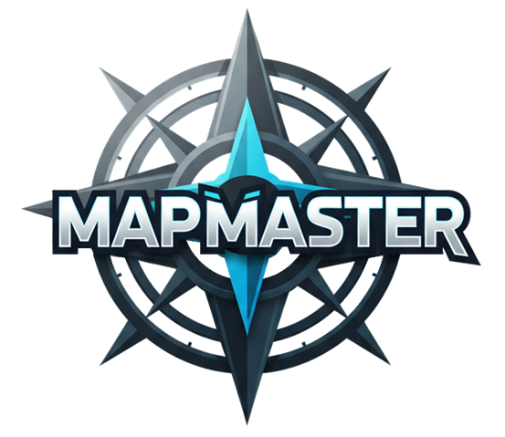

<p align="center">
  
</p>

<p align="center" style="font-size: 20px;">
  <i style="font-weight: bold;">One map to rule them all</i>
</p>
<p align="center">
    <i style="font-weight: bold;">Server</i>
</p>

<h4 align="center">

[](https://github.com/T0hsakaR1n126/sopra-fs25-group-10-server/actions/workflows/build.yml)
[](https://sonarcloud.io/summary/overview?id=T0hsakaR1n126_sopra-fs25-group-10-server)
[](https://github.com/T0hsakaR1n126/sopra-fs25-group-10-server/actions/workflows/dockerize.yml)

[](https://github.com/T0hsakaR1n126/sopra-fs25-group-10-server/graphs/contributors)
[](https://github.com/T0hsakaR1n126/sopra-fs25-group-10-server/blob/main/LICENSE)
[](https://github.com/T0hsakaR1n126/sopra-fs25-group-10-server/blob/main/NOTICE)


<h2 align="left">🧭 Introduction</h2> <strong>MapMaster</strong> is not just another geography game — it’s your new adventure across the globe! Dive into an interactive world map and put your knowledge to the test as you guess countries based on clever, progressively revealed hints about population, climate, history, and more. Whether you're flying solo, battling friends in multiplayer mode, or exploring at your own pace, MapMaster turns learning into a thrilling challenge. Powered by Spring Boot and cutting-edge frontend tech, this game delivers real-time interaction, smart scoring, and dynamic difficulty that keeps every round fresh and exciting. Ready to sharpen your geography skills and become a world map master? 
<h3 align="left">📌 Goal</h3> <p> MapMaster’s mission is simple: make geography *fun*, *engaging*, and *addictive*. It’s designed to help you boost your map smarts, recall countries faster, and compete with friends or players worldwide. Whether you’re a student, trivia buff, or travel fanatic, MapMaster offers a smooth, intuitive experience that’s perfect for all ages and skill levels. Get ready for fast-paced gameplay that turns learning into an unforgettable game! 
</p> <h3 align="left">📌 Motivation</h3> <p> Traditional geography drills can be dull. MapMaster was born to change that — transforming rote memorization into an exciting, interactive journey. In today’s world, keeping players hooked means blending education with entertainment seamlessly. Whether prepping for exams, teaching, or just indulging your curiosity, MapMaster is your go-to for a fresh, engaging way to connect with the world — one clue, one click, one country at a time. </p>


## Table of contents

- [Technologies](#technologies)
- [High-level components](#high-level-components)
- [Launch and Deployment](#launch-and-deployment)
- [Illustrations](#illustrations-and-game-flow)
- [Roadmap](#roadmap)
- [Authors](#authors)
- [Acknowledgment](#acknowledgement)
- [License](#license)

<a name="technologies"></a>

## Technologies
### 🛠️ Server Tech Stack
- **[Spring Boot](https://spring.io/projects/spring-boot)** – Java-based backend framework for building production-ready RESTful services efficiently.
- **[Spring STOMP over WebSocket](https://docs.spring.io/spring-framework/reference/web/websocket/stomp.html)** – Spring's built-in support for STOMP messaging over WebSocket, enabling real-time bidirectional communication between clients and the server.
- **[SockJS](https://github.com/sockjs)** – WebSocket emulation library ensuring reliable message delivery with fallback support.
- **[Mockito](https://site.mockito.org/)** – Java testing framework for mocking objects in unit tests, essential for effective test-driven development.
- **[Google Gemini API](https://ai.google.dev/gemini-api/docs)** – Used for generating dynamic, AI-powered clues for countries within the game.
- **[Swagger / SpringDoc OpenAPI](https://springdoc.org/)** – Automatically generates interactive API documentation from Spring Boot projects using OpenAPI 3.
- **[Google Cloud Platform (GCP)](https://cloud.google.com/)** – Cloud infrastructure for hosting backend services, scalable databases, storage, and AI integrations.
- **[Nix](https://nixos.org/)** – Declarative package manager that ensures consistent development and CI environments.
- **[Docker](https://www.docker.com/)** – Container platform for building, shipping, and running the backend in isolated, reproducible environments.

<a name="high-level-components"></a>
## High level components
Here we show you the component tree at L1 for this repository where you see most key components of the game. We explain the ones that are most important both for the game play and functioning.
```
├── Application.java
├── config
│   ├── CorsConfig.java
│   └── WebSocketConfig.java
├── constant
│   ├── Country.java
│   └── UserStatus.java
├── controller
│   ├── GameChatController.java
│   ├── GameController.java
│   └── UserController.java
├── entity
│   ├── ChatMessage.java
│   ├── Game.java
│   └── User.java
├── exceptions
│   └── GlobalExceptionAdvice.java
├── repository
│   ├── GameRepository.java
│   └── UserRepository.java
├── rest
│   ├── dto
│   └── mapper
└── service
    ├── GameService.java
    ├── UserService.java
    ├── UtilService.java
```

### [`main app folder`](./src/main/java/ch/uzh/ifi/hase/soprafs24/)
Primary directory of the springboot application code resides for this project where all the functionality and game centric confuguration exists. The tree above is from this directory.

### [`controller`](./src/main/java/ch/uzh/ifi/hase/soprafs24/controller/)
Three controller each for the [Game](./src/main/java/ch/uzh/ifi/hase/soprafs24/controller/GameController.java), [Chat](./src/main/java/ch/uzh/ifi/hase/soprafs24/controller//GameChatController.java) and [User](./src/main/java/ch/uzh/ifi/hase/soprafs24/controller/UserController.java) functions exist here. Game controller provides access to the controllers relevant to game creation, scoring logic, and other game processing logic.
Chat controller is aimed at providing ephemeral ws interfaces for chats both in chat and game.
User controller is positioned to address user related activites such as creation, update and tracking progress.

### [`service`](./src/main/java/ch/uzh/ifi/hase/soprafs24/service/)
Incidentally for all the contollers we mentioned above, services exist. Whole contollers are mere wrappers for the `clients` to establish communication majority of the functioning logic sits in the service. For each of Game and User controllers we see a service respectively: [Game](./src/main/java/ch/uzh/ifi/hase/soprafs24/service/GameService.java), [User](./src/main/java/ch/uzh/ifi/hase/soprafs24/service/UserService.java). [`UtilService`](./src/main/java/ch/uzh/ifi/hase/soprafs24/service/UserService.java) holds the key logic for hint generation, enabling caching requirements and logic requiring to ensure that users are given bias-free, incrementally easier hints. In the util service, you will also add your api key for the google gemini. 

### [`websocket`](./src/main/java/ch/uzh/ifi/hase/soprafs24/config/WebSocketConfig.java)
Webscoket configuration can be found here and all the websocker logic is embedded into the respective services we have seen. 

### [`tests`](./src/test/java/ch/uzh/ifi/hase/soprafs24/)
All the tests can be found here. The test names indicate the relevant block tests are written for.


## Launch and Deployment
<a name="Launch and Deployment"></a>

You will need to \
For Frontend: `git clone https://github.com/T0hsakaR1n126/sopra-fs25-group-10-client` \
For Backend: `git clone https://github.com/T0hsakaR1n126/sopra-fs25-group-10-server`

**Optional (for full compatibility)**
 - You have to briefly follow the steps for `nix` set up so that the project's development environment is setup as required. You can follow follow more detailed instructions for your development setup [here](SetupScratch.md)
- Once you have installed `nix` and other pre-requisites, you will be prompted to allow `direnv`. Then please do `direnv allow`.

**Straight Forward Setup** 
#### Prerequisites
Make sure you have installed:
- Your IDE, preferably IntelliJ or VSC
- Java JDK 17
- Gradle 8.7

You need to have:
- Access to the [GitHub project](https://github.com/T0hsakaR1n126/sopra-fs25-group-10-server) for the CI/CD
  Pipeline.
- Access to the GCP project `sopra-fs25-group-10-server`
- MailJet API credentials for sending notifications from the dev session.
- Installed and initialized the gcloud cli: https://cloud.google.com/sdk/docs/install-sdk

#### Setup Instructions
As for developing locally, everything is managed via an in memory H2 Database. So no setup is necessary.

1. **Clone the Repository**
2. **Build**
    ```bash
    ./gradlew build
    ```
3. **Run**
    ```bash
    ./gradlew bootRun
    ```
You can verify that the server is running by visiting `localhost:8080` in your browser.

4. **Test**
    ```bash
    ./gradlew test
    ```

### Development
Developers are encouraged to push to feature branches and create pull requests for code reviews. Ensure that all merge
conflicts are resolved and all tests pass before requesting a review.
Please create feature branches from the `development` branch.

### Deployment
For deployment, the project is set up with GitHub Actions for continuous integration and continuous deployment (CI/CD) to Google Cloud Platform. To perform a release:
1. Merge your changes into the main branch via pull request.
2. Ensure all GitHub Actions checks pass.
3. Once merged, GitHub Actions will automatically deploy the new version to Google Cloud.

<a name="illustration"></a>

## Illustrations
This  `.gif` image depicts our game flow rather quickly. This is aimed to help players understand game flow easily. 


<a name="roadmap"></a>

## Roadmap

- [ ] 🔄 Guest players can join games without registration  
- [ ] 🔄 Team vs Team gameplay mode  
- [ ] Configurable settings:  
  - [ ] Select continents or countries to be tested on  
  - [ ] Choose more difficulty levels
- [ ] Add other themes such as cities, rivers, food etc.
- [ ] Ability to end a round early  

<a name="authors"></a>

## Authors

| Name          | Personal page                                                                                                                                  |
|-------------------|----------------------------------------------------------------------------------------------------------------------------------------------- |
| Rohit KOONIREDDY  | [](https://github.com/rkoonireddy)  |
| Zheyuan FU        | [](https://github.com/T0hsakaR1n126) |
| Ziqi YANG         | [](https://github.com/yzq0325)      |
| Xinyu FU          | [](https://github.com/fuxinyu01)    |
| Jiawei Pei        | [](https://github.com/JaveyBae)   |

<a name="acknowledgement"></a>
### Acknowledgement

- This repository code derives the framework from the kind **UZH HASEL team** provided [SoPra FS25 - Client Template](https://github.com/HASEL-UZH/sopra-fs25-template-client).
- Many thanks to **[Silvan Schlegel](https://github.com/silvanschlegel)** who helped us as our TA and Scrum Master during this project.

<a name="license"></a>
## License
We publish the code under the terms of the [Apache 2.0 License](https://github.com/T0hsakaR1n126/sopra-fs25-group-10-client/blob/main/LICENSE) that allows distribution, modification, and commercial use. This software, however, comes without any warranty or liability.
